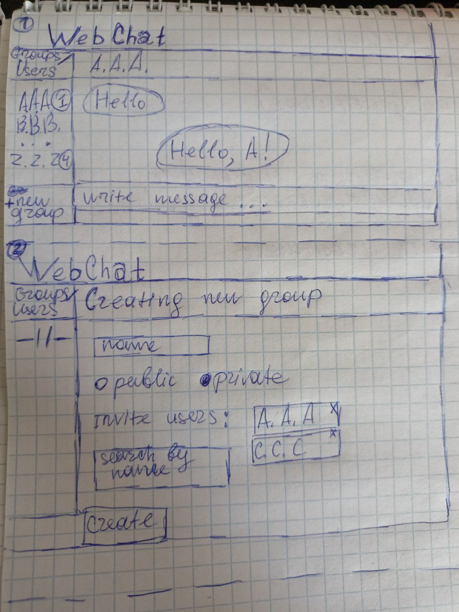

# 202312-ok-webchat

Учебный проект курса
[Kotlin Backend Developer](https://otus.ru/lessons/kotlin/).

WebChat -- это приложение для общения пользователей. Задача
приложения -- предоставить наиболее удобные интерфейсы для 
-- личных чатов
-- групповых чатов

## Визуальная схема фронтенда

## Документация

1. Аналитика:
    1. [Функциональные требования](docs/01-analysis/01-functional-requiremens.md)
2. DevOps
    1. [Файлы сборки](./deploy)
3. Архитектура
4. Тесты
